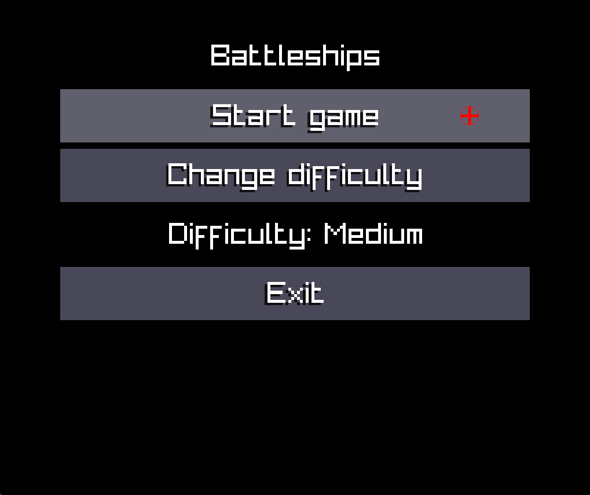
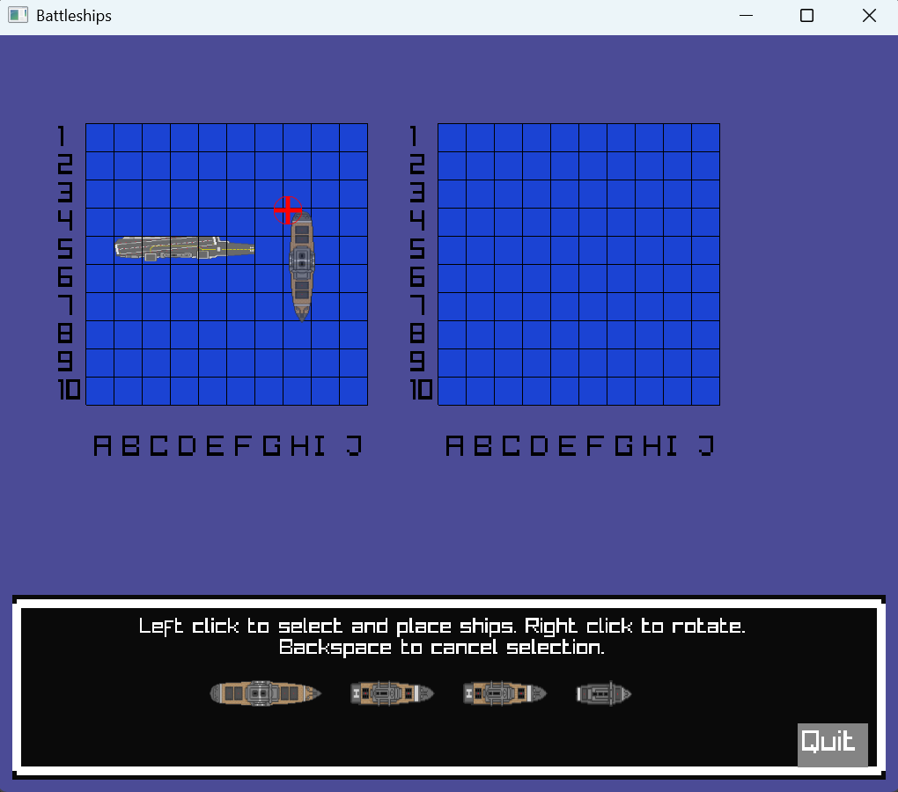
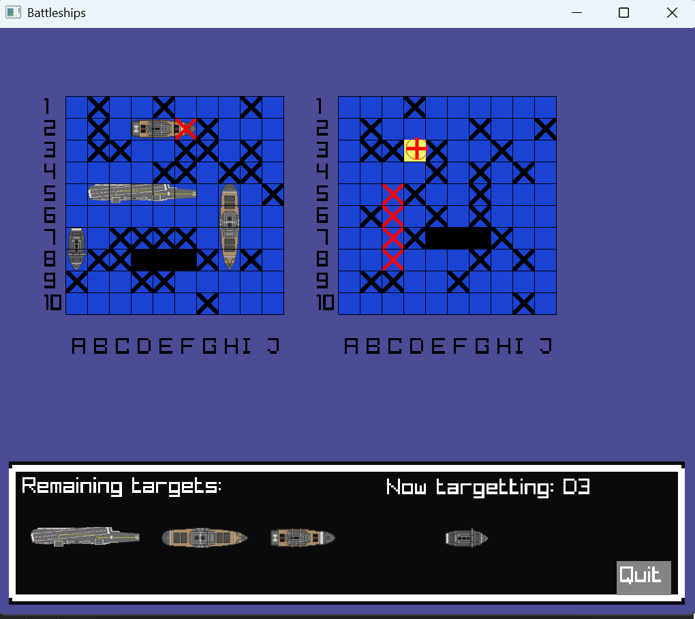
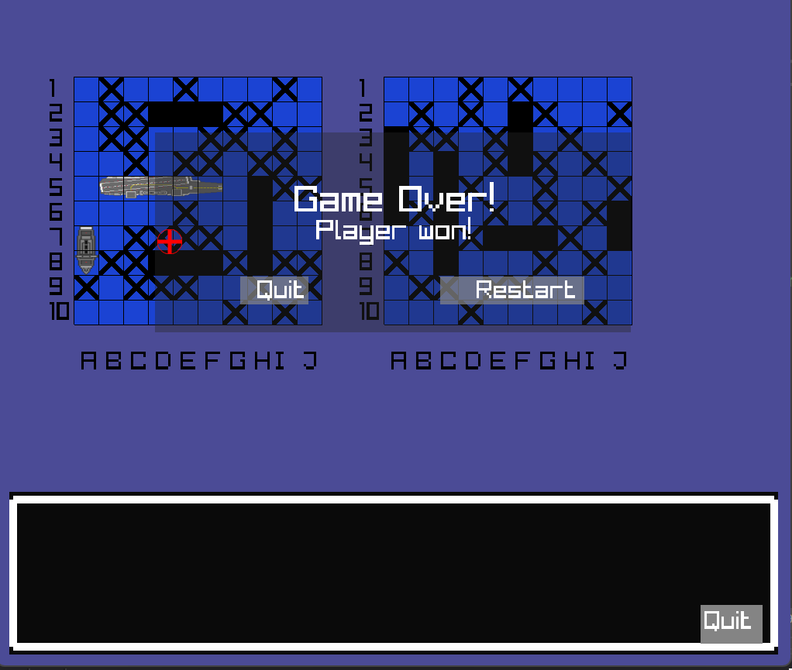

# Battleships

A modern implementation of the classic Battleships board game written in **C++17** using **Raylib**.

This project started as a programming exercise and evolved into a complete playable game featuring multiple AI difficulties, custom rendering, and data-oriented architecture.

---

## Screenshots

### Menu


### Ship Placement



### Gameplay



### Game over


---

## Features

### Gameplay

- Classic Battleships rules
- Manual ship placement
- Placement validation with visual feedback
- Hit and miss tracking
- Ship sinking detection
- Sound FX
- Victory and defeat conditions

### Artificial Intelligence

- Easy AI (random targeting)
- Medium AI (hunt / destroy targeting)
- Hard AI (smart seeking)
- Tracks remaining ship sizes
- Uses probability-based targeting after successful hits

### Technical Features

- Written in C++17
- Built using Raylib
- Cross-platform codebase
- Data oriented architecture
- Custom rendering and UI systems
- Sprite-sheet based asset pipeline

---

## Controls

### Ship Placement

| Action | Input |
|----------|----------|
| Select Ship | Left Mouse Button |
| Place Ship | Left Mouse Button |
| Rotate Ship | Right Mouse Button |
| Cancel Placement | Backspace |

### Gameplay

| Action | Input |
|----------|----------|
| Fire at Enemy Board | Left Mouse Button |

---

## Building

### Requirements

- CMake 3.16 or newer
- C++17 compatible compiler
- Raylib 5.x

### Windows

```bash
git clone http://github.com/szebasztian-sejer/Battleships.git
cd Battleships

cmake -B build
cmake --build build --config Release
```

### Linux

```bash
git clone http://github.com/szebasztian-sejer/Battleships.git
cd Battleships

cmake -B build
cmake --build build
```

### Termux / Android

The project has been tested on:

- Termux
- Termux:X11
- System-installed Raylib package

## About
The primary goal of this project was to improve my C++ programming skills by building a complete game from scratch.

During development I implemented:

- Custom board management
- Ship placement validation
- AI decision making
- Rendering systems
- State-driven game flow
- Asset management
- Cross-platform build support

The project continues to evolve as new features and improvements are added.

---

## License

This project is licensed under the MIT License.